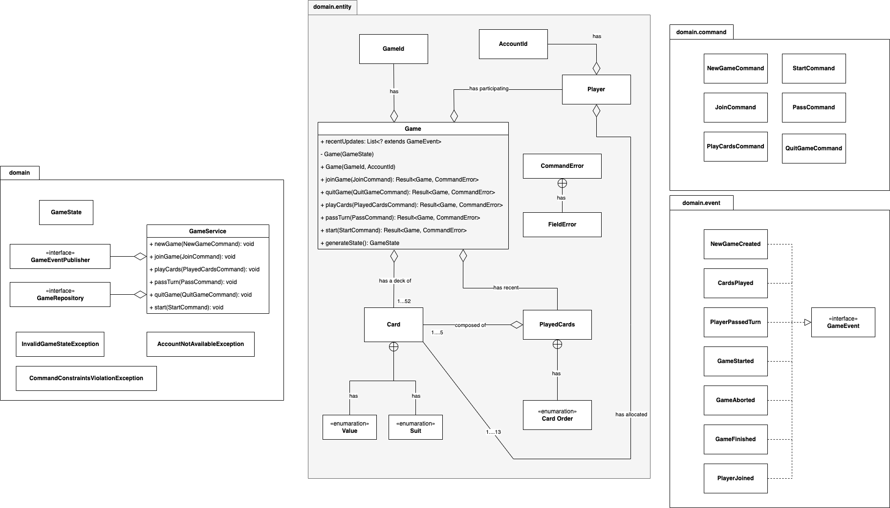

# Pusoy Dos Domain

## Assumptions

* Since Pusoy Dos game is an interactive game that can include up to 4 players,
it is understood that it is inherently push based software architecture wise.

## Model Design 

Design follows the Domain Driven Design concept. Using Java 9 modules, we tightly control
the enforcement of business logic by restricting access to the entity package (see domain.entity below) which houses
the domain aggregate and entities.

  