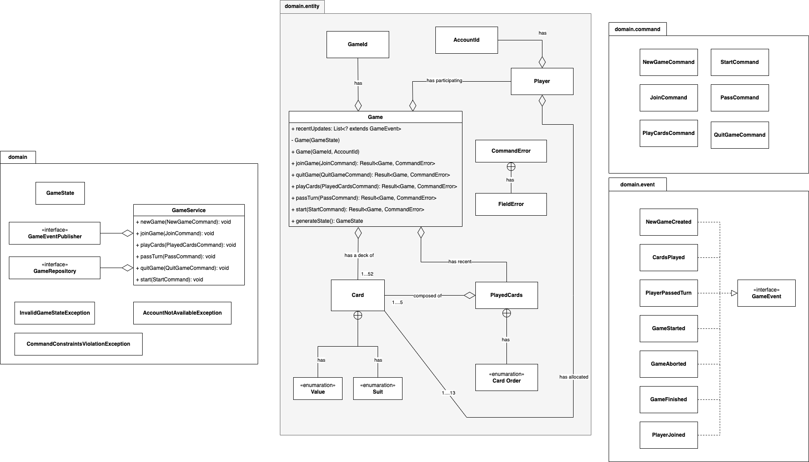

# Pusoy Dos Domain

This module contains the implementation of the Pusoy Dos Game. This module is lightweight and is not tied up
to any application development framework or infrastructure technology. This module exposes `GameRepository` and 
`GameEventPublisher` interfaces for the application layer to decide the appropriate persistence and publisher 
implementation according to its needs.

## Model Design 

Design follows the Domain Driven Design concept. Using Java 9 modules, we tightly control
the enforcement of business logic by restricting access to the entity package (see `domain.entity` below) which houses
the domain aggregate and entities.

## Notable domain concepts

### `Game`
The central entity here is the `Game`. It acts as the aggregate for all 
the game related transactions. As an aggregate, it has different methods to validate and process different 
Pusoy Dos related operations commands. It is also responsible for executing the commands properly using the other
entity (`Player`) and value objects (`PlayedCards`, and `Card`)

### `GameDomainService`
The GameDomainService acts as a glue for supporting a durable execution of a command. The usual flow of 
logic is

1. Retrieve the current state of `Game`
2. Invoke the appropriate `Game` command handler
3. Persist the update `Game` entity state using the `GameRepository` instance
4. Publish the `GameEvent` generated from successful command execution using the `GameEventPublisher`.

If a command violates validation required by the handler, the service wraps the errors using the appropriate exceptions

### `GameState`

The `GameState` encapsulates the current state of `Game`. It acts as the application visible equivalent of `Game`. 
By using this concept, the module effectively hides the entity package from application level modules. The 
`Game` entity has a constructor that accepts a `GameState` instance. Before property assignment, this constructor 
executes validation logic to ensure that the `Game` instance is always valid during the execution of a command.

### `GameRepository`

The `GameRepository` is a contract required to be implemented by the application layer. It exposes several methods
required by the `GameDomainService` to verify a player account id, and retrieving and persisting the `GameState`.

### `GameEventPublisher`

The `GameEventPublisher` is another contract required to be implemented by the application layer. It exposes a method
required by the `GameDomainService` to publish `GameEvent` corresponding to the successful execution of a command.

  